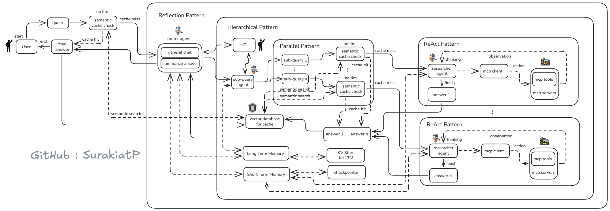
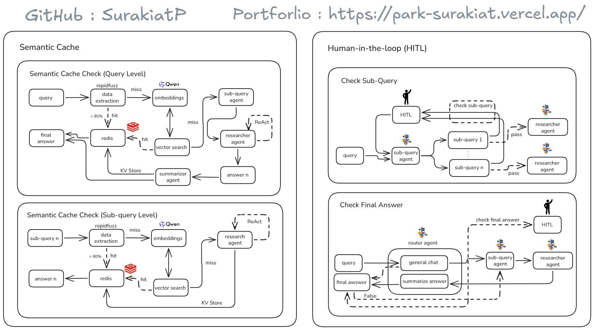
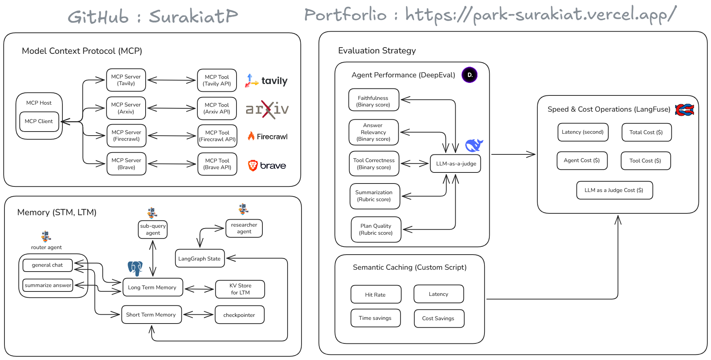
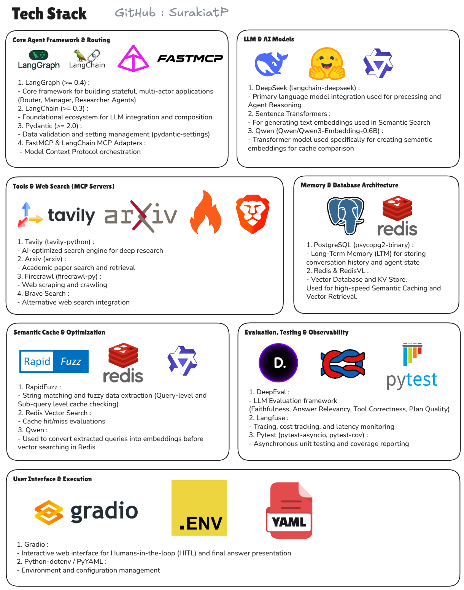
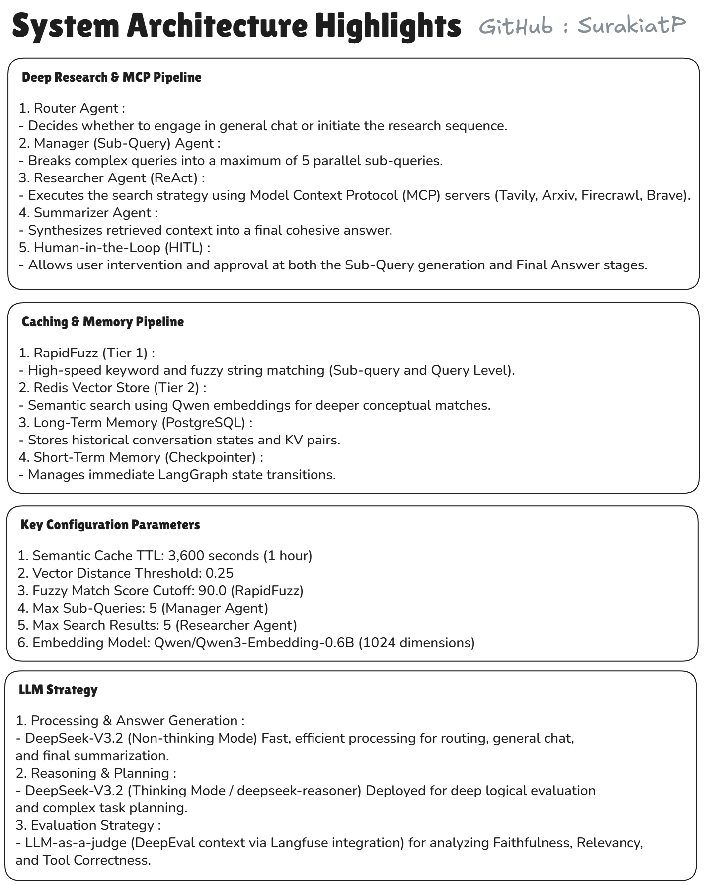
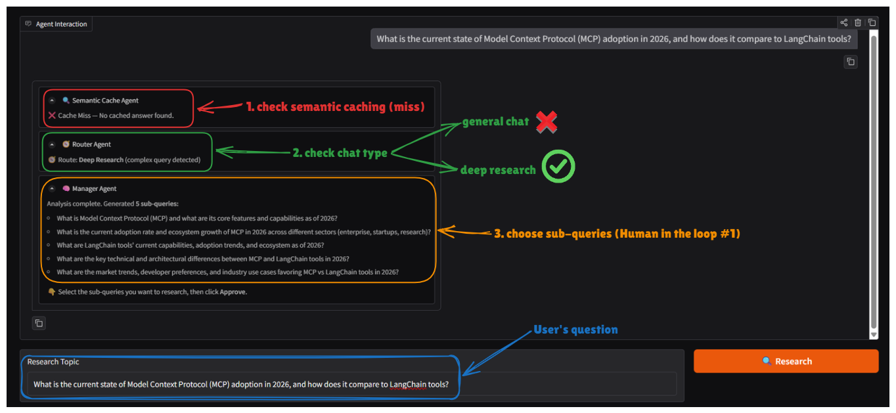
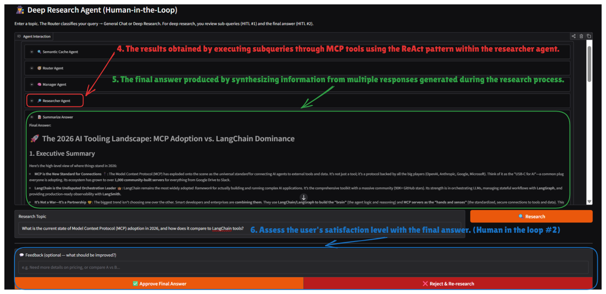
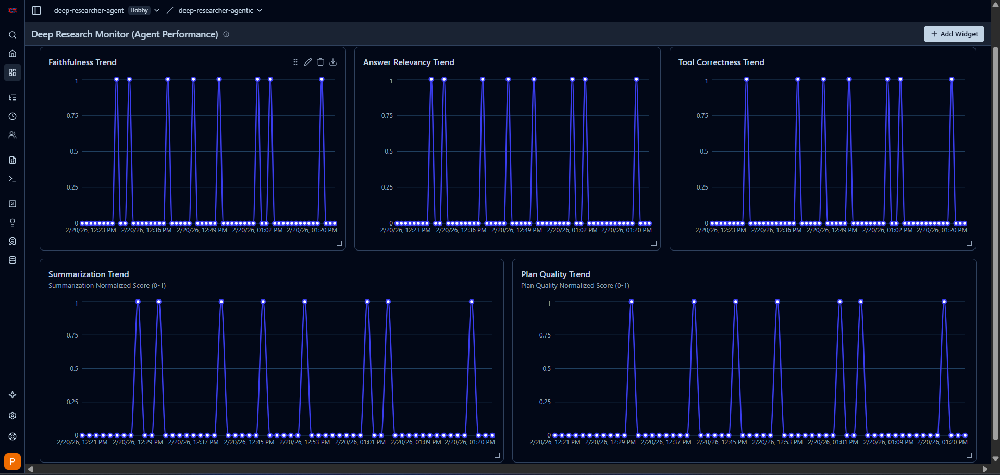
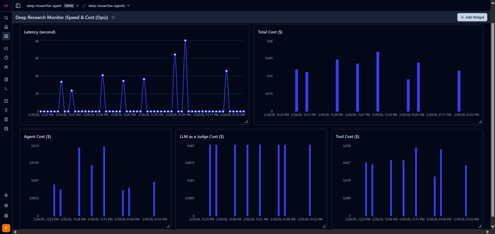

# Agentic Research System


A powerful, multi-agent AI research system built with **LangGraph**, **RedisVL**, and **PostgreSQL**. The Agentic Research System is designed to intelligently route queries, break down complex topics into sub-queries, gather real-time data using Model Context Protocol (MCP) tools, and synthesize comprehensive, logically grounded answers. It leverages a dual-LLM strategy and incorporates Human-in-the-Loop (HITL) checkpoints for ultimate accuracy.

---

## Key Features

*   **Intelligent Routing**: Automatically distinguishes between casual chat and deep research requirements.
*   **Reflection & ReAct Patterns**: Employs reasoning loops to gather, evaluate, and refine information.
*   **Semantic Data Caching**: Uses **RapidFuzz** for high-speed keyword matching and **Qwen embeddings** via **Redis Vector Search** to dramatically reduce API costs and latency.
*   **Dual Memory System**:
    *   **Long-Term Memory (PostgreSQL)**: Persistent KV storage for historical conversation states.
    *   **Short-Term Memory**: LangGraph checkpointer for continuous state transitions.
*   **Model Context Protocol (MCP)**: Native integration with Tavily, Arxiv, Firecrawl, and Brave Search for broad, real-time context retrieval.
*   **Human-in-the-Loop (HITL)**: Interactive Gradio UI allowing users to approve or reject generated sub-queries and final answers.
*   **Comprehensive Evaluation**: Built-in observability using **Langfuse** and metric evaluations (Faithfulness, Relevancy) via **DeepEval**.

---

## System Architecture & Highlights

Overview of the system architecture and integration of each component (Click images to enlarge):

### 1. Overall System Pipeline


### 2. Semantic Cache & Human-in-the-loop (HITL)


### 3. MCP Integrations & Memory


---

## Tech Stack



*   **Core Agent Framework**: LangGraph, LangChain, FastMCP
*   **LLM & AI Models**: 
    *   `DeepSeek-V3.2` (Processing & Chat)
    *   `deepseek-reasoner` (Reasoning & Evaluation)
    *   `Qwen/Qwen3-Embedding-0.6B` (Semantic Cache Embeddings)
*   **Databases**: PostgreSQL (LTM), Redis (Semantic Cache / Vector DB)
*   **Evaluation & Observability**: DeepEval, Langfuse
*   **UI Framework**: Gradio

*(Detailed Architecture and Configurations can be seen below)*



---

## Getting Started

### Prerequisites

1.  **Python 3.10** or higher
2.  Running **Redis Server** (Port 6379 for Semantic Cache)
3.  Running **PostgreSQL** (For Long-Term Memory)

### Installation

1. **Clone the repository:**
   ```bash
   git clone https://github.com/SurakiatP/agentic-research-system.git
   cd agentic-research-system
   ```

2. **Install dependencies:**
   The `pyproject.toml` is configured, so you can install it via pip:
   ```bash
   pip install -e .
   ```

3. **Configure Environment Variables:**
   Copy the `.env.example` file to `.env` and fill in the necessary API keys:
   ```bash
   cp .env.example .env
   ```
   *(Required API keys include DeepSeek, Tavily, Langfuse, and Postgres Credentials)*

---

## Usage

Run the project to launch the Gradio UI:

```bash
python run.py
```
> The system runs on port `7860`. You can access it at `http://127.0.0.1:7860`

### User Interface Preview

**Sub-Queries Generation (Manager Agent)**
Users can verify the sub-topics and click Approve before the system proceeds with research:


**Final Answer & Synthesis**
The final output is presented with options for user decision (Approve Final Answer or Reject & Re-research):


---

## Agent Performance & Evaluation

The system's quality is systematically evaluated using **DeepEval**, measuring against custom rubrics with `deepseek-reasoner` serving as the judge model. Based on a benchmark of diverse test queries (ranging from deep technical research to general chat), the Agentic Research System achieved:

| Metric | Score / Result | Description |
| :--- | :---: | :--- |
| **Overall Average** | `0.85 / 1.0` | Normalized score across all technical and general test queries. |
| **Faithfulness & Relevancy** | `[1.0]` | Maintained strict adherence to retrieval context across verified Deep Research queries. |
| **Tool Correctness** | `[1.0]` | Consistently selected the precise expected MCP tools and external search strategies. |
| **Research Plan Quality** | `[5.0 / 5.0]` | Flawless rating from the judge for generating logical, comprehensive sub-queries prior to execution. |
| **Time & Cost Efficiency** | `~$0.09` | Baseline cost for a deep research query, taking roughly 3 to 4 minutes to complete full execution. |

### Observability (Langfuse Dashboards)

This project features comprehensive monitoring dashboards via **Langfuse**:

*   **Agent Performance**: Tracks correctness metrics like Faithfulness, Relevancy, and Tool Correctness.
    

*   **Speed & Cost (Ops)**: Measures latency and tracks costs separated by Agent, Judge, and Tool Operations.
    

*   **Cache Efficiency**: Analyzes Cost and Time Savings derived from the Semantic Cache system.
    

---

## Contributing
Feel free to submit Pull Requests or open Issues if you encounter any bugs or have feature suggestions. 

## Author

**Surakiat Kansa-ard**

*   **GitHub**: [https://github.com/SurakiatP](https://github.com/SurakiatP)
*   **LinkedIn**: [https://www.linkedin.com/in/surakiat-kansa-ard-171942351/](https://www.linkedin.com/in/surakiat-kansa-ard-171942351/)

## License
This project is open-source and available under the terms of the MIT License.
